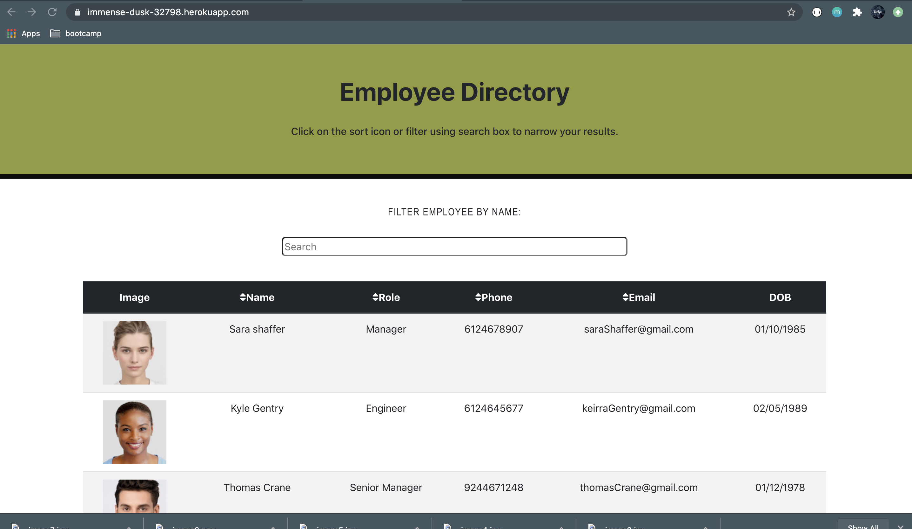
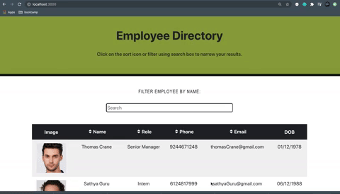

# React Employee Directory


This application allows the user to view their employee directory, and have easy access to employee information.They may also filter and find specific employees by searching for an employee's name in the search box.

## Technologies Used

* HTML
* CSS
* JavaScript
* Node.js
* React

## Table of Contents

1. [Description](#Description)
2. [Installation](#Installation)
3. [Usage](#Usage)
4. [License](#License)

## Description

This Application allows the user quick access to employee information, they are able to sort employees in ascending or descending order in each of the following categories: name,role, phone number, email. This UI designed using react that breaks UI into components, manage component state and respond to user events.

## Installation

* Clone the repository to your local device.
* Install the necessary npm packages by typing in the following command in the terminal:

```
npm install
```

## Usage

* This app is simple to run and is set up to use port 3000 for local running. Start the program in terminal with the code below:

```
npm start 
```
* Another way to run this App is to, Navigate to [Heroku site](https://immense-dusk-32798.herokuapp.com/) and get started to use this Application.

* In order to filter employees by name, type a name into the search bar.
* In order to sort the employee list by name, email, phone number, or DOB, click on that sort icon near the table header.
* Click on the icon again to switch the sorting order.

## License

[MIT](public/license) license

## Screenshots




